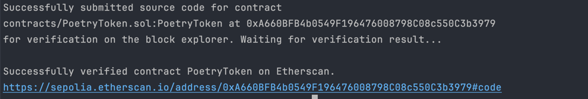

# dlt-smart-contract-hw

## Preparation

1. Install [npm](https://docs.npmjs.com/downloading-and-installing-node-js-and-npm)
2. Download initial dependencies:

```
npm install --save-dev hardhat 
npm install --save-dev @openzeppelin/contracts
npm install --save-dev @nomiclabs/hardhat-ethers
npm install --save-dev @nomicfoundation/hardhat-toolbox
npm i --save-dev @types/mocha
npm install --save-dev chai
```

## Token

Implemented token is a version of publishing poetry text in Ethereum
blockchain [see [PoetryToken.sol](contracts/PoetryToken.solyToken.sol)
].

As fields it has a `tokenIdCounter` and a special id-to-poetry mapping `_poetryMapping`.

Functions:

- `function publishPoetry(string memory poetryText) external returns (uint256)` -- accepts poetry, increments current
  id, safely mints & transfers tokenId, calls poetry text setter
- `function _setPoetryText(uint256 tokenId, string memory poetryText) private` -- private setter; accepts poetry text,
  provides id check, "sets" the poetry text for a specific token & signals that poetry was published
- `function getPoetryText(uint256 tokenId) external view returns (string memory)` -- public getter; accepts token id,
  provides id check, returns poetry according to the id

__Contract deployed to address:__ 0xA660BFB4b0549F196476008798C08c550C3b3979. You can check
it [here](https://sepolia.etherscan.io/).




Verified [here](https://sepolia.etherscan.io/address/0xA660BFB4b0549F196476008798C08c550C3b3979#code).

## Tests

In order to run tests, run

```
npx hardhat test test/PoetryToken.ts
```

Note: I tried, but I honestly didn't find the mistake...

## Comments

You can insert your own private and public keys as well. In `.env` mine are provided (because it is an educational
project :))